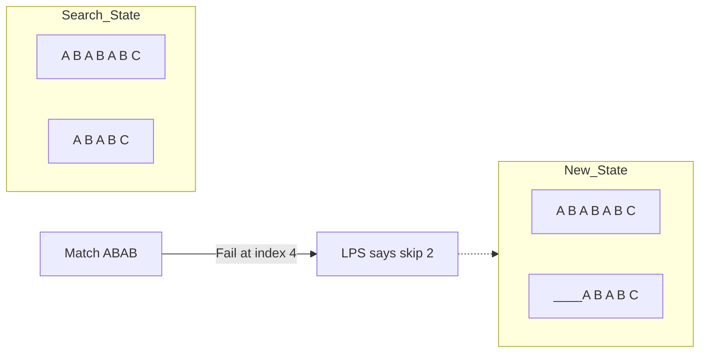

# String Algorithms: Patterns & Matching

## 1. Pattern Matching: The Naive vs. The Pro

### Naive Search
Check every possible starting position.
- **Complexity**: $O(n \cdot m)$

---

## 2. KMP (Knuth-Morris-Pratt) Algorithm

### Conceptual Overview
KMP avoids redundant comparisons by using information from previous matches. It uses a **Partial Match Table** (LPS - Longest Prefix which is also a Suffix).

### Schematic: The "Skip" Logic


**LPS Calculation**: $O(m)$
**Search Time**: $O(n)$

---

## 3. Rabin-Karp: Hashing it Out

### Conceptual Overview
Use a **Rolling Hash** to compare the pattern with substrings of the text.
- If hashes match $\rightarrow$ verify the characters (to handle collisions).
- If hashes don't match $\rightarrow$ move to next window.

### Schematic: Rolling Hash
```mermaid
graph LR
    subgraph Window_1 [Hash: 123]
    W1[A B C]
    end
    
    subgraph Window_2 [Hash: (123 - 'A')*P + 'D']
    W2[B C D]
    end
    
    W1 -- "Slide" --> W2
    style W2 fill:#6f9
```

**Complexity**: $O(n + m)$ average.

---

## 4. Z-Algorithm

### Conceptual Overview
The Z-algorithm produces an array $Z$ where $Z[i]$ is the length of the longest common prefix between $S$ and the suffix of $S$ starting at $i$.

**Use Case**: Pattern matching by constructing string $P + '$#' + T$.

---

## 5. Developer Cheat Sheet

| Algorithm | Strategy | Best Use Case |
| :--- | :--- | :--- |
| **KMP** | LPS Array | Competitive programming, Single pattern |
| **Rabin-Karp** | Rolling Hash | Multi-pattern search, Plagiarism check |
| **Z-Algorithm** | Prefix matching | Simple implementation, Suffix properties |
| **Aho-Corasick**| Trie + KMP | Searching for thousands of patterns at once |

### Critical Patterns
- **String Hashing**: Essential for $O(1)$ substring comparisons.
- **Trie + BFS**: Foundation for Aho-Corasick.
- **Palindrome Hashing**: Finding palindromes in $O(n)$.
