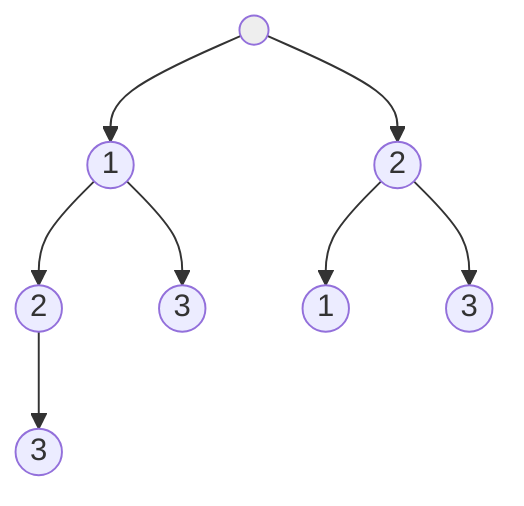

# Backtracking & Greedy Algorithms

## 1. Backtracking (Exhaustive Search)

### Conceptual Overview
**Backtracking** is a refined brute-force technique. It builds a solution incrementally and "backtracks" (undoes the last step) as soon as it determines that the current path cannot lead to a valid solution.

**Analogy**: Exploring a maze. When you hit a dead end, you go back to the last fork in the road and try a different path.

### Visual Representation (Permutations)


### Common Patterns
- **Permutations/Combinations**: Generating all possible arrangements.
- **Subsets**: Generating all possible groupings.
- **N-Queens**: Placing pieces on a board without conflict.
- **Pathfinding**: Finding a path in a grid with obstacles.

---

## 2. Greedy Algorithms (Local Optimization)

### Conceptual Overview
A **Greedy Algorithm** makes the locally optimal choice at each step with the hope of finding the global optimum.

**Key Rule**: Greedy only works if the problem has the **Greedy Choice Property** (a local optimum leads to a global optimum).

### Classic Example: Coin Change (Standard denominations)
If you want to give 47 cents change using [25, 10, 5, 1]:
- Take 25: (Remaining 22)
- Take 10: (Remaining 12)
- Take 10: (Remaining 2)
- Take 1: (Remaining 1)
- Take 1: (Remaining 0)
*This works for standard USD coins, but doesn't work for all sets of denominations (e.g., [1, 3, 4] to make 6)!*

---

## 3. Comparison: Backtracking vs. DP vs. Greedy

| Approach | Strategy | Best for... |
| :--- | :--- | :--- |
| **Backtracking**| Try everything, undo if wrong. | Finding **all** solutions. |
| **DP** | Solve subproblems, build up. | Finding the **optimal** solution (min/max). |
| **Greedy** | Pick the best now. | Finding a **fast** solution (when it works). |

---

## 4. Developer Tips & Practical Knowledge

### The "State Reset" in Backtracking
The most common mistake in backtracking is forgetting to **undo** the change.
```python
def backtrack(path):
    if is_valid(path):
        res.append(list(path))
        return
    
    for choice in choices:
        path.append(choice) # 1. Choose
        backtrack(path)     # 2. Explore
        path.pop()          # 3. Un-choose (Crucial!)
```

### When to use Greedy?
Use Greedy when you can prove that making a local choice won't block you from the global best.
- **Sorting** first often unlocks greedy solutions (e.g., Interval Scheduling).
- **Heaps** are frequently used to pick the "best" item efficiently.

### Real-world use cases
- **Backtracking**: Sudoku solvers, RegEx engines, Database query optimizers.
- **Greedy**: Data compression (Huffman coding), Network routing (OSPF), Minimal Spanning Trees.
