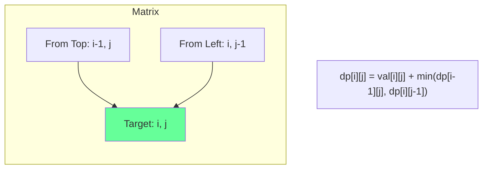
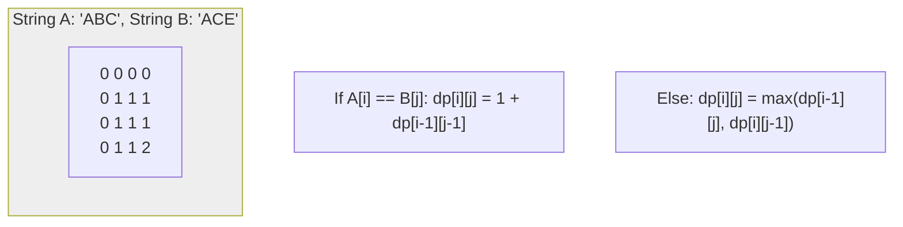

# Dynamic Programming: The Art of Storing State

## 1. Space Optimization: The "Sliding Variable" Schematic
In many DP problems, you don't need the entire $O(n)$ table. You only need the previous 1 or 2 states.

### Schematic: Fibonacci Optimization
```mermaid
graph LR
    subgraph Iteration_N [Calculate F(n)]
    P1[Prev2] --- P2[Prev1] --- C[Current]
    end
    
    subgraph Iteration_N1 [Calculate F(n+1)]
    NP1[Prev1] --- NP2[Current] --- NC[New Current]
    end
    
    Iteration_N -- "Shift Pointers" --> Iteration_N1
    
    style C fill:#f9f
    style NC fill:#6f9
```
**Result**: Space reduced from $O(n)$ to $O(1)$.

---

## 2. DP on Grids: The "Flow" Schematic

### Conceptual Overview
Finding the "Minimum Path Sum" from $(0,0)$ to $(n,m)$. You can only move Right or Down.

### Schematic: Transition Logic


---

## 3. String DP: Longest Common Subsequence (LCS)

### Schematic: State Transition Matrix


---

## 4. Advanced Sub-Topics

### Bitmask DP
Using a bitmask to represent a "set" of used items.
- **Complexity**: $O(2^n \cdot n)$.
- **Use Case**: Traveling Salesperson Problem (TSP).

### Interval DP
Solving subproblems defined by a range $[i, j]$.
- **Complexity**: $O(n^3)$.
- **Use Case**: Matrix Chain Multiplication, Burst Balloons.

---

## 5. Developer Cheat Sheet

| DP Pattern | Strategy | Example Problem |
| :--- | :--- | :--- |
| **0/1 Knapsack** | Pick / Don't Pick | Target Sum |
| **Unbounded Knapsack**| Infinite Supply | Coin Change |
| **Grid DP** | Move Right/Down | Unique Paths |
| **String DP** | Match / No Match | Edit Distance |

### Critical Patterns
- **Identify Substructure**: Does the answer to $n$ depend on $n-1, n-2, \dots$?
- **Iterative > Recursive**: Avoid recursion depth limits and stack overhead.
- **Base Cases**: Always define $dp[0]$ or $dp[0][0]$ first.
