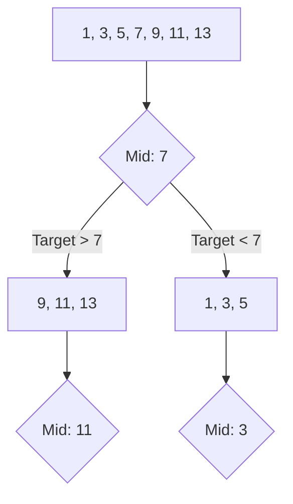
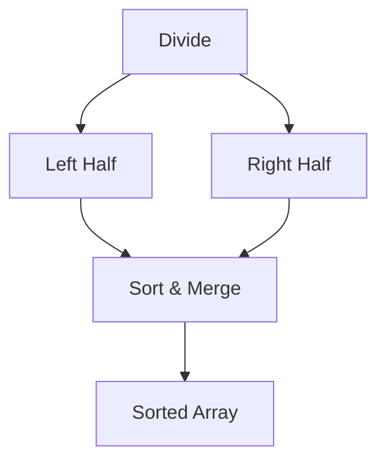

# Sorting & Searching

## 1. Searching Algorithms

### Binary Search (The Gold Standard)
**Conceptual Overview**: A "divide and conquer" search algorithm. It works on **sorted arrays** by repeatedly dividing the search interval in half.

**Visual Representation**

**Complexity**: O(log n)

---

## 2. Sorting Algorithms (The Big Three)

### A. Merge Sort (Stable & Reliable)
**Conceptual Overview**: Recursively split the array in half until you have single elements, then merge them back in sorted order.

**Visual Representation**

- **Complexity**: O(n log n) always.
- **Space**: O(n) (requires extra space for merging).

### B. Quick Sort (The Fastest in Practice)
**Conceptual Overview**: Pick a "pivot" element. Partition the array so elements < pivot are on the left, and elements > pivot are on the right. Recurse.

- **Complexity**: O(n log n) average, O(n²) worst case (if pivot is poorly chosen).
- **Space**: O(log n) (recursion stack).

### C. Heap Sort (O(1) Space)
**Conceptual Overview**: Build a Max-Heap from the array. Repeatedly extract the maximum element (root) and move it to the end of the array.

- **Complexity**: O(n log n) always.
- **Space**: O(1) (in-place).

---

## 3. Comparison Table

| Algorithm | Best | Average | Worst | Space | Stable? |
| :--- | :--- | :--- | :--- | :--- | :--- |
| **Merge Sort** | O(n log n) | O(n log n) | O(n log n) | O(n) | Yes |
| **Quick Sort** | O(n log n) | O(n log n) | O(n²) | O(log n) | No |
| **Heap Sort** | O(n log n) | O(n log n) | O(n log n) | O(1) | No |
| **Insertion Sort**| O(n) | O(n²) | O(n²) | O(1) | Yes |

---

## 4. Developer Tips & Real-World Usage

### Timsort: The Real World Secret
Most modern languages (Python, Java, JS) don't use pure Merge or Quick sort. They use **Timsort**, a hybrid of Merge Sort and Insertion Sort designed to perform well on real-world data (which is often already partially sorted).

### When to use which?
- **Small datasets**: **Insertion Sort** is often faster due to low overhead.
- **Memory is tight**: **Heap Sort** (O(1) space).
- **Stability matters**: **Merge Sort** (e.g., sorting a list of students by name, then by grade).
- **General purpose**: **Quick Sort** (usually the fastest average-case performance).

### Binary Search "Templates"
Don't just search for a value. Binary search can be used for:
- **Leftmost/Rightmost element** in a range of duplicates.
- **"Square root"** of a number.
- **Smallest value that satisfies a condition** (Search Space reduction).
