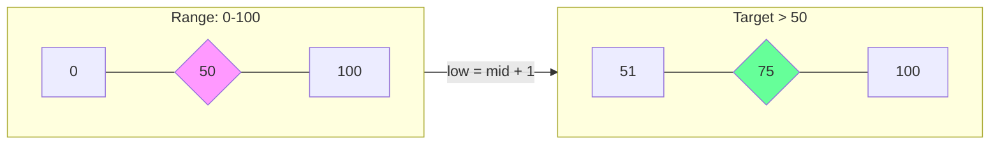
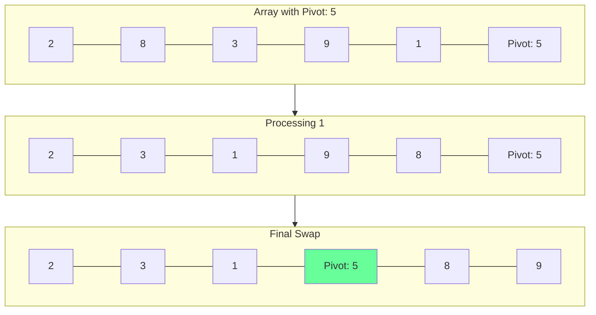

# Sorting & Searching: The Efficiency Core

## 1. Binary Search: The "Range Reduction" Schematic
Binary Search isn't just for finding a value; it's for **Search Space Reduction**.

### Schematic: The `[Left, Right]` Collapse

**Developer Tip**: Use `low + (high - low) // 2` to avoid integer overflow in languages like C++/Java.

---

## 2. QuickSort: The Partitioning Logic

### Conceptual Overview
The heart of QuickSort is the **Partition** step. We pick a pivot and move everything smaller to the left and larger to the right.

### Schematic: Lomuto Partitioning

---

## 3. Stability & In-Place Algorithms

### A. Sorting Stability
A sort is **Stable** if it preserves the relative order of elements with equal keys.
- **Stable**: Merge Sort, Insertion Sort, Bubble Sort.
- **Unstable**: QuickSort, Heap Sort, Selection Sort.

### B. In-Place Algorithms
An algorithm is **In-Place** if it uses only $O(1)$ extra space (excluding the recursion stack).
- **In-Place**: QuickSort, Heap Sort, Insertion Sort.
- **Not In-Place**: Merge Sort (requires $O(n)$ extra space).

---

## 4. Advanced Sub-Topics

### Counting Sort & Radix Sort
Non-comparison based sorting that can achieve **O(n)** time.
- **Requirement**: The data must be integers within a specific range.

### Search Space Binary Search
Applying binary search on the **Answer** instead of the input array.
- **Example**: "Minimum time to complete all tasks" where you binary search between `min_time` and `max_time`.

---

## 5. Developer Cheat Sheet

| Algorithm | Average Time | Space | Stable? | When to use? |
| :--- | :--- | :--- | :--- | :--- |
| **QuickSort** | $O(n \log n)$ | $O(\log n)$ | No | General purpose, fast in-place |
| **MergeSort** | $O(n \log n)$ | $O(n)$ | **Yes** | Linked lists, Stability needed |
| **HeapSort** | $O(n \log n)$ | **O(1)** | No | Limited memory |
| **Timsort** | $O(n \log n)$ | $O(n)$ | **Yes** | Most real-world data (Hybrid) |

### Critical Patterns
- **Median of Three**: Improving QuickSort pivot selection.
- **Kth Largest Element**: Using QuickSelect (average $O(n)$).
- **Binary Search on Answer**: Solving optimization problems.
