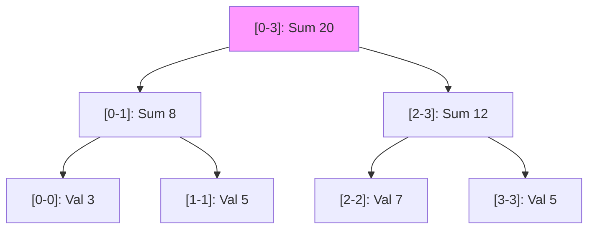
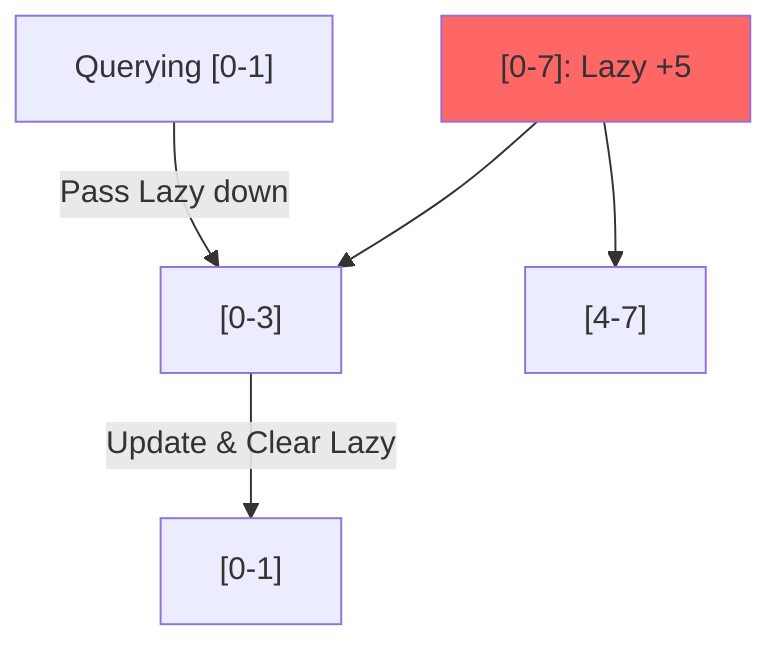

# Advanced Trees: Segment Trees & Fenwick Trees

## 1. Segment Trees (The Versatile Range Tool)

### Conceptual Overview
A **Segment Tree** is a tree data structure used for storing information about intervals, or segments. It allows querying which of the stored segments contain a given point, or querying the sum/min/max of a range in $O(\log n)$ time.

### Schematic: Range Representation


### Key Operations
- **Build**: $O(n)$
- **Update (Point)**: $O(\log n)$
- **Query (Range)**: $O(\log n)$

---

## 2. Fenwick Tree (Binary Indexed Tree / BIT)

### Conceptual Overview
A Fenwick tree is a more space-efficient alternative to a Segment Tree for prefix sums and point updates. It uses the binary representation of indices to store partial sums.

### Schematic: The Binary Relationship
```mermaid
graph LR
    subgraph BIT_Structure
    I1[idx 1: (0001)] --> I2[idx 2: (0010)]
    I3[idx 3: (0011)] --> I4[idx 4: (0100)]
    I2 --> I4
    end
    
    Update["idx += idx & (-idx)"]
    Query["idx -= idx & (-idx)"]
    
    style BIT_Structure fill:#dfd
```

### When to use BIT over Segment Tree?
- **BIT**: Easier to implement, uses less memory ($O(n)$ exactly), only supports **commutative** operations (Sum, XOR) and usually only point updates with range queries.
- **Segment Tree**: Supports any operation (Min, Max, GCD) and supports **Lazy Propagation** for range updates.

---

## 3. Lazy Propagation (Segment Tree Pro)

### Conceptual Overview
Instead of updating all nodes in a range immediately, we "defer" the work by marking a node as "lazy". We only update children when we actually visit them.

### Schematic: The Lazy Tag


---

## 4. Developer Cheat Sheet

| Feature | Segment Tree | Fenwick Tree (BIT) |
| :--- | :--- | :--- |
| **Complexity** | $O(\log n)$ | $O(\log n)$ |
| **Space** | $O(4n)$ | $O(n)$ |
| **Implementation**| Harder | Easier |
| **Range Updates** | Yes (Lazy) | Possible but complex |
| **Min/Max Query** | Yes | No (Usually) |

### Critical Patterns
- **Coordinate Compression**: Mapping large ranges to small integers (e.g., $10^9 \rightarrow 10^5$) before building the tree.
- **Dynamic Segment Tree**: Building nodes on the fly to save space for sparse data.
