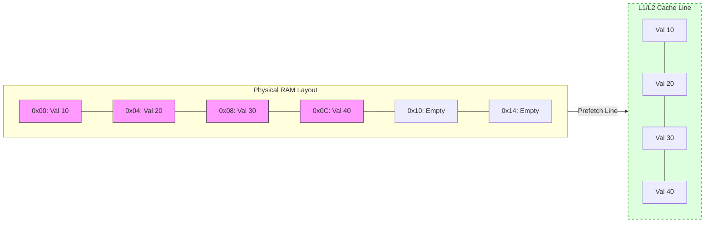
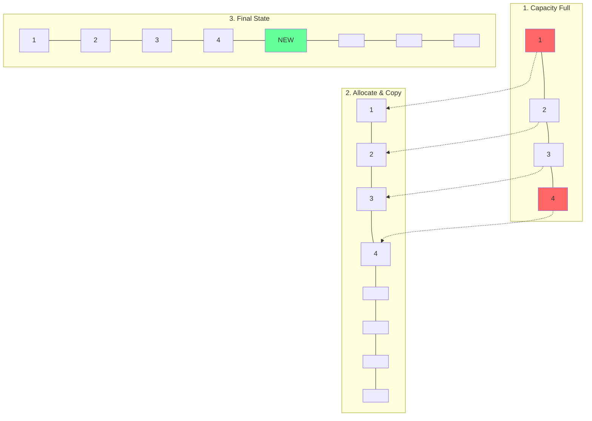
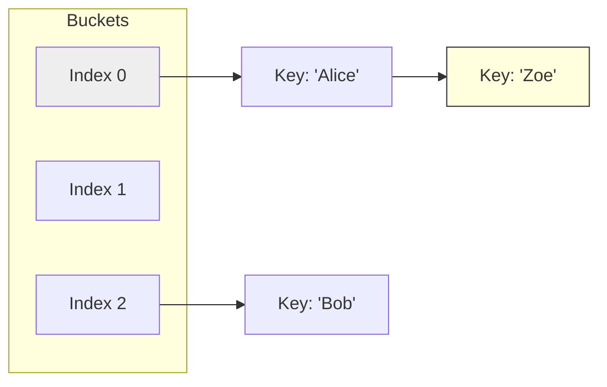
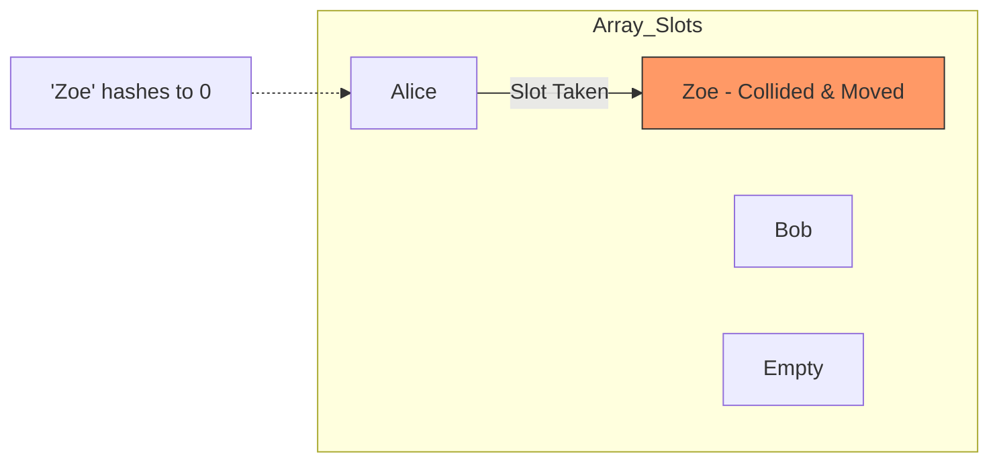

# Arrays & Hashing: Architectural Deep Dive

## 1. The Physical Layer: Memory Layout

### Schematic: Contiguous Memory vs. Sparse Access
An array is a promise of **Cache Locality**. The CPU doesn't just fetch one element; it fetches a "Cache Line" containing neighbors.

---

## 2. Dynamic Arrays: The Resizing Mechanic

### Conceptual Overview
When a dynamic array (like `std::vector` or Python `list`) exceeds its **Capacity**, it performs an "Amortized" operation:
1. Allocates a new block of memory (usually **2x** the size).
2. Copies all elements to the new block.
3. Frees the old block.

### Schematic: The Double-and-Copy Strategy

---

## 3. Hash Tables: The Collision Battlefield

### Schematic: Collision Resolution (Chaining vs Open Addressing)

#### A. Separate Chaining (Linked Lists)

#### B. Open Addressing (Linear Probing)

---

## 4. Advanced Sub-Topics & Nuances

### Hash Functions: The "Uniform Distribution" Goal
A high-quality hash function must:
1. **Deterministic**: Same input $\rightarrow$ Same output.
2. **Fast**: O(1) time to compute.
3. **Minimize Collisions**: Spread keys across the entire table.

### Load Factor ($\alpha$)
$\alpha = \frac{n}{k}$ where $n$ is the number of entries and $k$ is the number of buckets.
- **Threshold**: Usually 0.7 to 0.75.
- **When $\alpha > Threshold$**: Performance drops from $O(1)$ toward $O(n)$. The table **must** resize (rehash).

---

## 5. Developer Cheat Sheet

| Feature | Static Array | Dynamic Array | Hash Map |
| :--- | :--- | :--- | :--- |
| **Search (Key)** | O(n) | O(n) | **O(1) Avg** / O(n) Worst |
| **Access (Index)** | **O(1)** | **O(1)** | N/A |
| **Insert (End)** | O(1) / N/A | **O(1) Amortized** | **O(1) Avg** |
| **Memory** | Fixed | Dynamic (Over-allocated) | Large Overhead |

### Critical Patterns
- **Prefix Sums**: Range queries in $O(1)$.
- **Two Pointers**: Collapsing search space.
- **Sliding Window**: Dynamic range processing.
- **Difference Array**: Batch updates to ranges.
