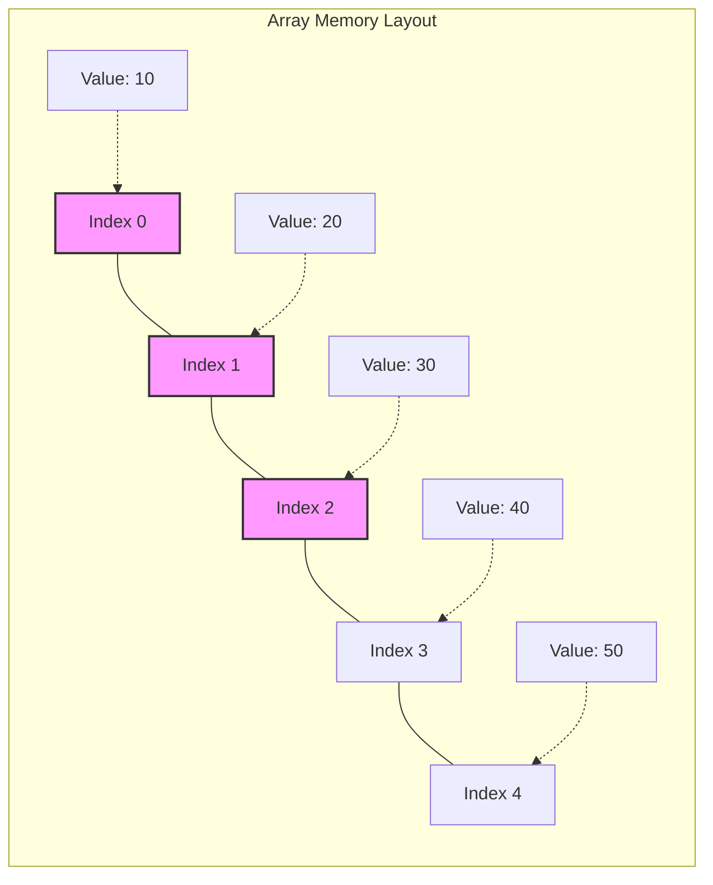

# Arrays & Hashing

## 1. Arrays (The Foundation)

### Conceptual Overview
An **Array** is a collection of items stored at contiguous memory locations. Think of it like a row of lockers in a school hallway. Each locker has a fixed size, and they are all right next to each other.

### Visual Representation


### Key Properties
- **Random Access**: O(1) time to access any element if you know the index.
- **Contiguous Memory**: Elements are stored back-to-back, which is cache-friendly.
- **Fixed vs. Dynamic**: Static arrays have fixed size; Dynamic arrays (like Python Lists or JS Arrays) resize automatically.

---

## 2. Hash Tables (The Powerhouse)

### Conceptual Overview
A **Hash Table** (or Hash Map) is a data structure that maps keys to values. Think of it like a library's filing cabinet. You give the librarian a book title (key), they run it through a system (hash function) to get a drawer number (index), and they find the book (value) there.

### Visual Representation
```mermaid
graph TD
    Key[Key: 'username'] --> HF[Hash Function]
    HF --> Index[Index: 42]
    subgraph Hash Table Buckets
    B0[Bucket 0]
    B1[...]
    B42[Bucket 42: {'username': 'ajay'}]
    BN[Bucket N]
    end
    Index --> B42
```

### The Magic: Hashing & Collisions
- **Hash Function**: Turns a key into a numeric index. A good function distributes keys uniformly.
- **Collisions**: When two keys hash to the same index.
    - **Chaining**: Each bucket is a Linked List.
    - **Open Addressing**: Find the next available slot.

---

## 3. Developer Tips & Practical Knowledge

### Why Contiguous Memory Matters (Cache Locality)
Modern CPUs use caches (L1, L2, L3). When you access an array element, the CPU fetches a "cache line" (usually 64 bytes). This means it fetches the next few elements too! This makes array iteration incredibly fast compared to Linked Lists.

### Hash Table Load Factor
When a Hash Table gets too full (usually > 70%), "collisions" increase, and performance degrades from O(1) to O(n). Most languages handle resizing automatically by doubling the capacity.

### Complexity Table

| Operation | Array (Static) | Array (Dynamic) | Hash Table (Avg) | Hash Table (Worst) |
| :--- | :--- | :--- | :--- | :--- |
| **Access** | O(1) | O(1) | N/A | N/A |
| **Search** | O(n) | O(n) | O(1) | O(n) |
| **Insertion**| O(n) | O(1)* | O(1) | O(n) |
| **Deletion** | O(n) | O(n) | O(1) | O(n) |

*\*Amortized O(1) for Dynamic Array insertion at the end.*

### Common Patterns
- **Frequency Map**: Using a hash map to count occurrences.
- **Two Sum Pattern**: Using a hash map to store seen values and check for complements in O(1).
- **Prefix Sum**: Pre-calculating sums to answer range queries in O(1).
