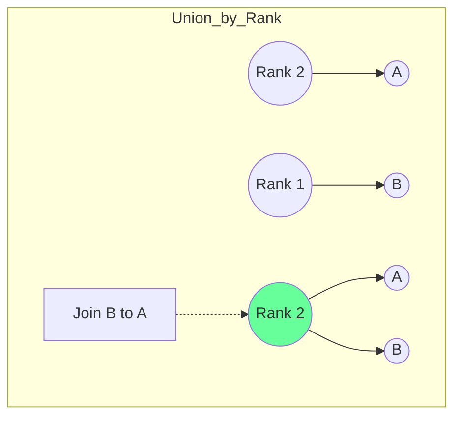
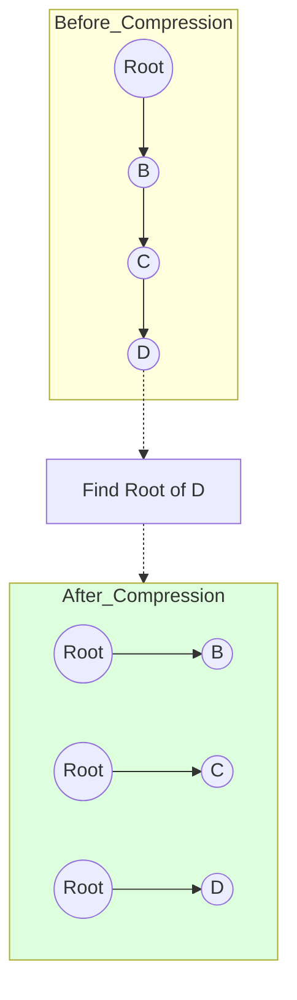

# Graphs & Disjoint Set Union: The Web of Data

## 1. Graph Storage: Matrix vs. List

### Schematic: Memory Profile Comparison
How we store a graph determines the efficiency of our algorithms.

```mermaid
graph LR
    subgraph Adjacency_Matrix [Memory: O(V²)]
    direction TB
    M[0 1 0<br>1 0 1<br>0 1 0]
    end
    
    subgraph Adjacency_List [Memory: O(V+E)]
    direction TB
    L0[Node 0] --> L1[1]
    L1_Node[Node 1] --> L01[0] --> L2[2]
    L2_Node[Node 2] --> L12[1]
    end
    
    style Adjacency_Matrix fill:#fdd
    style Adjacency_List fill:#dfd
```

| Method | Space | Edge Check | Find Neighbors |
| :--- | :--- | :--- | :--- |
| **Matrix** | $O(V^2)$ | **O(1)** | $O(V)$ |
| **List** | **O(V+E)** | $O(deg(V))$ | **O(deg(V))** |

---

## 2. Disjoint Set Union (DSU) Optimizations

### Schematic: Union by Rank (Keep it Shallow)
Instead of arbitrary joining, we attach the shorter tree to the root of the taller one.



### Schematic: Path Compression (Flattening)
During a `find` operation, we point every node along the path directly to the root.



---

## 3. Advanced Sub-Topics

### Bipartite Graphs
A graph where vertices can be divided into two independent sets $U$ and $V$ such that every edge connects a vertex in $U$ to one in $V$. (Can be checked using **BFS Coloring**).

### Strongly Connected Components (SCC)
In a directed graph, an SCC is a portion where every vertex is reachable from every other vertex in that portion.
- **Algorithm**: Tarjan's or Kosaraju's.

### Euler Path vs. Hamiltonian Path
- **Euler**: Visit every **edge** exactly once. (O(E) check).
- **Hamiltonian**: Visit every **vertex** exactly once. (NP-Complete).

---

## 4. Developer Cheat Sheet

| Feature | DFS | BFS | DSU |
| :--- | :--- | :--- | :--- |
| **Use Case** | Cycles, Paths | Shortest Path | Connectivity |
| **Data Struct** | Stack/Recursion | Queue | Array (Parent Map) |
| **Complexity** | O(V+E) | O(V+E) | O(α(N)) |

### Critical Patterns
- **Topological Sort**: Ordering tasks with dependencies.
- **Cycle Detection**: Using "Visited" and "Recursion Stack".
- **Number of Islands**: BFS/DFS in a 2D matrix.
