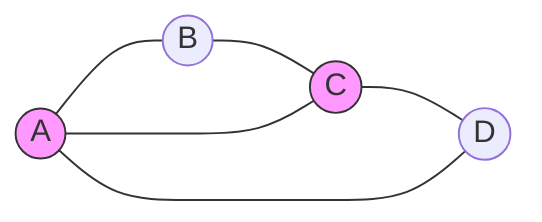
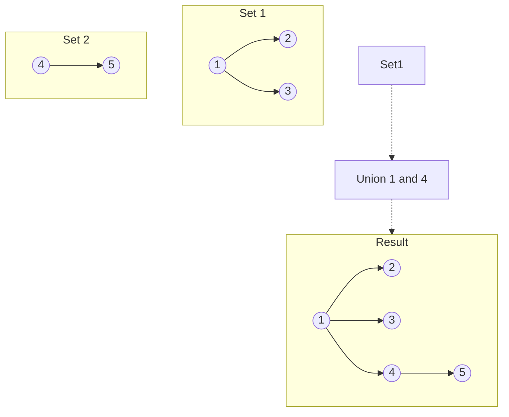

# Graphs & Disjoint Set Union (DSU)

## 1. Graph Fundamentals

### Conceptual Overview
A **Graph** is a non-linear data structure consisting of **Vertices** (nodes) and **Edges** (connections). Graphs can represent social networks, maps, internet routing, and more.

### Types of Graphs
- **Directed vs. Undirected**: Edges have a direction or are bidirectional.
- **Weighted vs. Unweighted**: Edges have a cost/weight or are equal.
- **Cyclic vs. Acyclic**: Whether you can return to a node by following edges.

### Visual Representation

---

## 2. Graph Representations

### Adjacency Matrix
A 2D array where `matrix[i][j] = 1` if there's an edge from $i$ to $j$.
- **Space**: O(V²)
- **Check Edge**: O(1)
- **Best for**: Dense graphs.

### Adjacency List (Developer Favorite)
An array of lists. `list[i]` contains all neighbors of node $i$.
- **Space**: O(V + E)
- **Find Neighbors**: O(degree(V))
- **Best for**: Sparse graphs (most real-world scenarios).

---

## 3. Disjoint Set Union (DSU / Union-Find)

### Conceptual Overview
DSU is a data structure that keeps track of elements partitioned into a number of disjoint (non-overlapping) sets. It provides two near-constant time operations:
1. **Find**: Determine which set an element belongs to.
2. **Union**: Join two sets into a single set.

**Analogy**: Think of "friend circles". Initially, everyone is their own circle. When two people become friends, their entire circles merge.

### Visual Representation

---

## 4. Key Properties & Optimizations (DSU)

### Path Compression (Find Optimization)
During `find(x)`, we make every node in the path point directly to the root. This flattens the tree.

### Union by Rank/Size (Union Optimization)
Always attach the smaller tree under the root of the larger tree. This keeps the tree height minimal.

**Complexity**: With both optimizations, operations are almost constant time: **O(α(n))**, where α is the inverse Ackermann function (extremely slow-growing, effectively < 5 for any practical $n$).

---

## 5. Developer Tips & Common Patterns

### Adjacency List with HashMaps
For nodes that aren't 0-indexed integers (e.g., strings), use `Map<String, List<String>>`.

### Implicit Graphs
Many problems (like Word Ladder or Matrix problems) are "implicit graphs". You don't build the graph; you treat the state transitions or matrix cells as nodes.

### Cycle Detection
- **Undirected**: Use BFS/DFS (check if neighbor is already visited and not the parent) or DSU (if `find(u) == find(v)` before union).
- **Directed**: Use DFS with a "recursion stack" or Kahn's Algorithm (Topological Sort).
