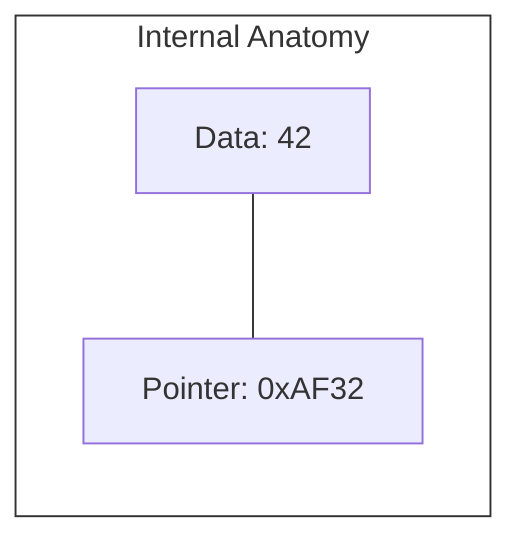
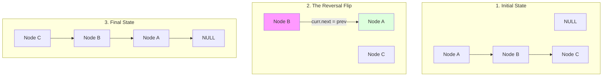
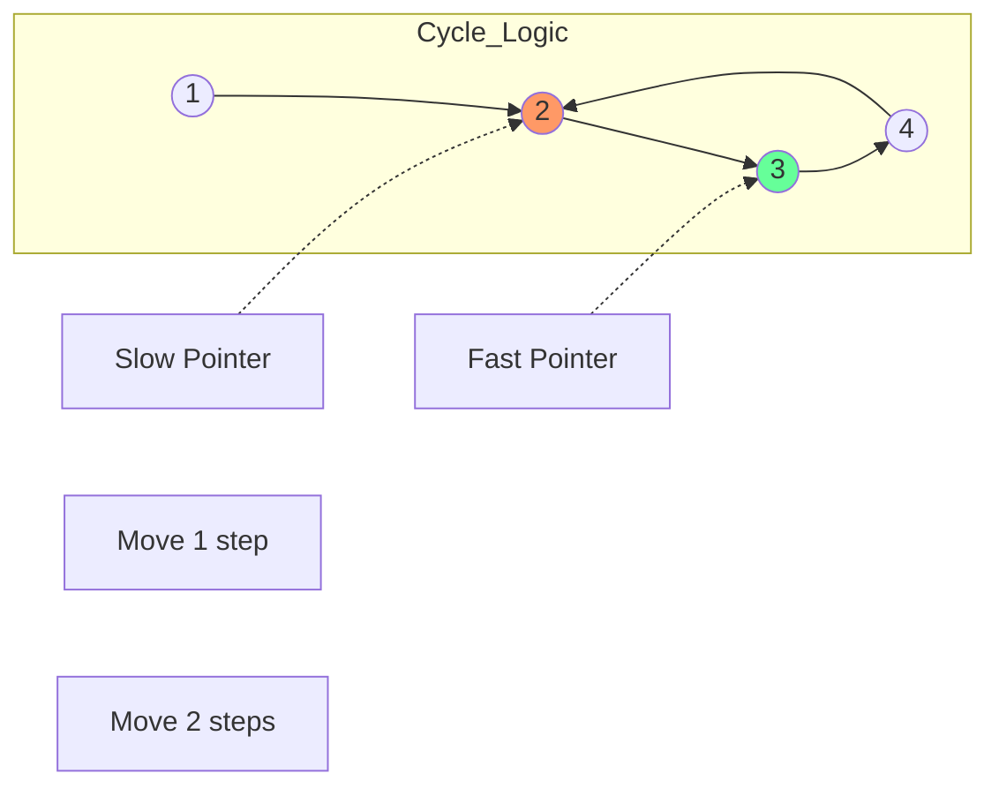

# Linked Lists: Beyond the Basics

## 1. The Anatomy of a Node
A Node is the fundamental building block. Unlike array elements, nodes can be scattered anywhere in the **Heap** memory.

---

## 2. Reversing a Linked List: A Schematic
Reversing is the most common interview question. It requires 3 pointers: `prev`, `curr`, and `next`.

### Schematic: Step-by-Step Transformation

---

## 3. The Power Move: Fast & Slow Pointers
Also known as the **Floyd's Cycle-Finding Algorithm** (Tortoise and Hare).

### Schematic: Cycle Detection

**Applications**:
1. **Finding the Middle**: When `Fast` reaches the end, `Slow` is at exactly the middle.
2. **Cycle Detection**: If `Fast` ever meets `Slow`, there is a loop.
3. **Cycle Entrance**: After meeting, move `Slow` to head; move both 1 step at a time. They meet at the entrance.

---

## 4. Advanced Sub-Topics

### Skip Lists
A probabilistic data structure that allows $O(\log n)$ search by using multiple layers of "express lanes" (linked lists).

### Memory Management & Cache Misses
Linked lists are notoriously bad for modern CPU caches.
- **Problem**: Accessing `node.next` often requires a round-trip to Main RAM because the next node isn't in the cache line.
- **Solution**: Use **Unrolled Linked Lists** (each node stores an array of elements) to improve locality.

---

## 5. Developer Cheat Sheet

| Operation | Singly Linked | Doubly Linked | Circular |
| :--- | :--- | :--- | :--- |
| **Reverse** | O(n) Time, O(1) Space | O(n) | O(n) |
| **Delete Node** | O(1)* (if given node) | O(1) | O(1) |
| **Traverse** | Forward Only | Bidirectional | Continuous |

### Critical Patterns
- **Dummy Head**: To simplify edge cases in insertion/deletion.
- **Fast & Slow Pointers**: For middle/cycles.
- **Recursion**: For complex tree-like manipulations on lists.
