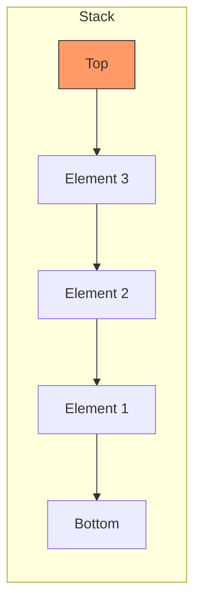
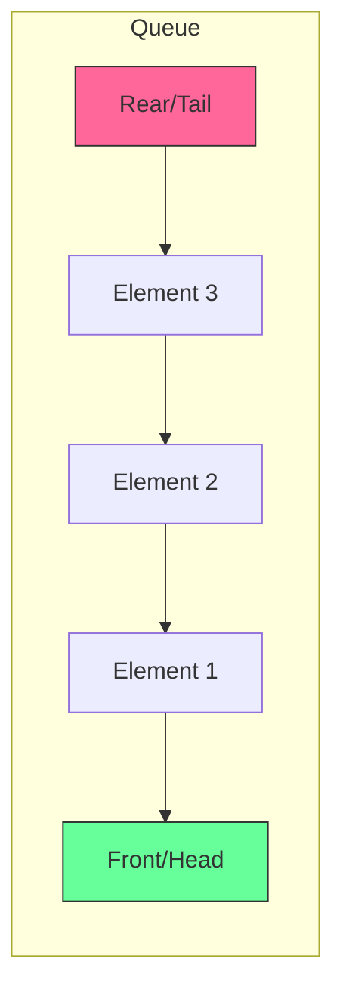

# Stacks & Queues

## 1. Stack (LIFO - Last In, First Out)

### Conceptual Overview
A **Stack** is a linear data structure that follows the LIFO principle.
**Analogy**: A stack of plates in a cafeteria. You add a new plate to the top, and you take the top plate off first.

### Visual Representation

### Key Operations
- **Push**: Add an item to the top. O(1)
- **Pop**: Remove the top item. O(1)
- **Peek/Top**: View the top item without removing it. O(1)

---

## 2. Queue (FIFO - First In, First Out)

### Conceptual Overview
A **Queue** follows the FIFO principle.
**Analogy**: A line of people waiting for coffee. The first person in line is the first one served.

### Visual Representation

### Key Operations
- **Enqueue**: Add an item to the back. O(1)
- **Dequeue**: Remove an item from the front. O(1)
- **Front/Peek**: View the front item. O(1)

---

## 3. Advanced Variants

### Deque (Double-Ended Queue)
Pronounced "deck". Allows insertion and deletion from both the front and the back. It's the most flexible linear structure.

### Priority Queue
Elements are removed based on **priority**, not just arrival time. Usually implemented with a **Heap**.

---

## 4. Developer Tips & Practical Knowledge

### Common Patterns
- **Monotonic Stack**: A stack where elements are always in increasing or decreasing order. Used to find the "next greater element".
- **BFS (Breadth-First Search)**: Uses a **Queue** to explore nodes layer by layer.
- **DFS (Depth-First Search)**: Uses a **Stack** (explicitly or via the recursion call stack).

### Implementation Choice
- **Array-based**: Faster access, but limited by capacity (or resizing cost).
- **Linked-List-based**: Truly dynamic, but higher memory overhead and no cache locality.

### Real-world use cases
- **Stack**: Undo/Redo operations, Expression parsing (compilers), Backtracking.
- **Queue**: Task scheduling (OS), Print queues, Breadth-First Search.
- **Priority Queue**: Dijkstra's algorithm, Huffman coding.
