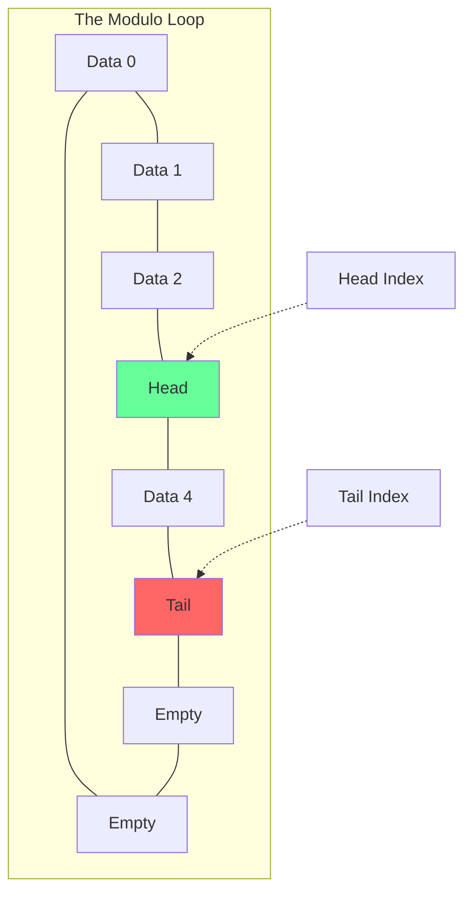
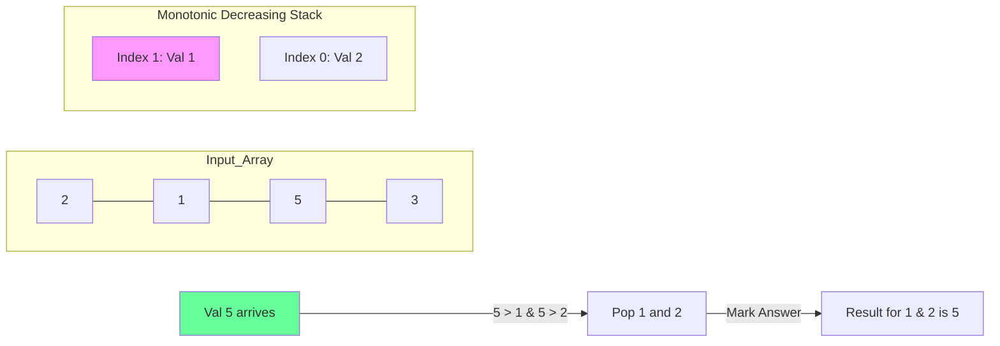

# Stacks & Queues: Strategic Data Structures

## 1. Stack: The LIFO Powerhouse

### Schematic: The Function Call Stack
Modern programming depends on the stack for recursion and function calls.

```mermaid
graph BT
    subgraph RAM_Stack [Memory Stack Frame]
    direction BT
    F1[main()] --- F2[getUser()] --- F3[dbQuery()]
    end
    
    subgraph CPU_Ops [Stack Operations]
    Push((Push)) -.-> F3
    F3 -.-> Pop((Pop))
    end
    
    style F3 fill:#f96,stroke:#333
    style RAM_Stack fill:#f0f0f0
```

---

## 2. Queue: The FIFO Pipeline

### Schematic: Circular Queue (Optimized Memory)
In a static array, a standard queue eventually runs out of space at the back even if the front is empty. A **Circular Queue** wraps around.


**Formula**: `(index + 1) % capacity`

---

## 3. The Interview Killer: Monotonic Stack

### Conceptual Overview
A stack where elements are kept in a specific order (always increasing or always decreasing). When a new element breaks the order, we "pop" until the order is restored.

### Schematic: Next Greater Element
Problem: Find the first element to the right that is larger than the current.



**Complexity**: $O(n)$ total (each element is pushed and popped exactly once).

---

## 4. Advanced Sub-Topics

### Deque (Double-Ended Queue)
Implemented typically as a **Doubly Linked List** or a **Circular Dynamic Array**.
- **Use Case**: Sliding Window Maximum problem ($O(n)$ solution).

### Priority Queue vs. Standard Queue
A Priority Queue is NOT a queue in the traditional sense; it's a **Heap**. Use it when you need to "process the most important item first" rather than "first come, first served".

---

## 5. Developer Cheat Sheet

| Data Structure | Best Implementation | Primary Use Case |
| :--- | :--- | :--- |
| **Stack** | Dynamic Array (`ArrayList`) | DFS, Undo, Expression Parsing |
| **Queue** | Linked List (`LinkedList`) | BFS, Task Scheduling |
| **Deque** | `ArrayDeque` (Java) / `collections.deque` (Py) | Sliding Windows |

### Critical Patterns
- **Monotonic Stack**: For range-based comparisons (Next Greater/Smaller).
- **Two Stacks = Queue**: Classic design problem.
- **BFS with Queue**: Layer-by-layer traversal.
