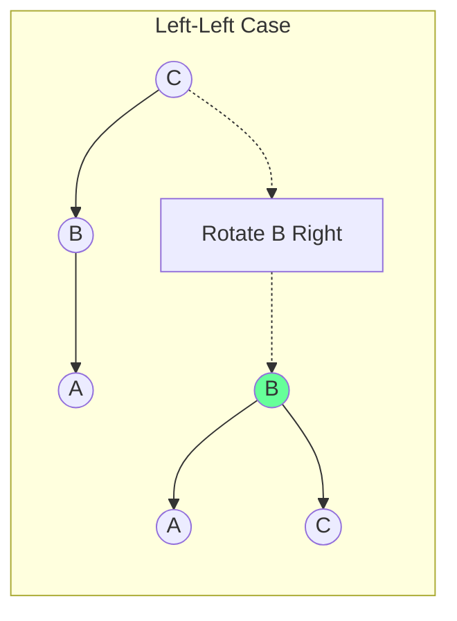
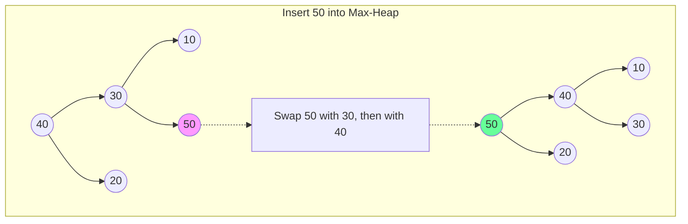
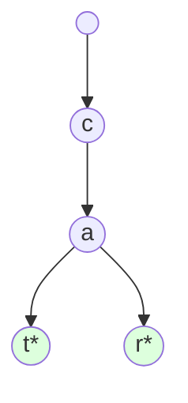

# Trees & Tries: Hierarchical Architecture

## 1. Binary Search Trees (BST) & Balancing

### Schematic: AVL Rotations (Restoring Balance)
A BST becomes inefficient ($O(n)$) if it becomes skewed. **AVL Trees** use rotations to maintain $O(\log n)$ height.

---

## 2. Heaps: The Array-Based Tree

### Conceptual Overview
Heaps are **Complete Binary Trees** stored in an **Array**.
- Parent of $i$: `(i-1) // 2`
- Children of $i$: `2i + 1`, `2i + 2`

### Schematic: Heapify (Sift-Up / Sift-Down)
When inserting into a **Max-Heap**, we add to the end and "Sift-Up".

---

## 3. Tries: The Prefix Schematic

### Schematic: Storing "CAT" and "CAR"

**Space Efficiency**: Common prefixes are shared, making Tries ideal for dictionary lookups.

---

## 4. Tree Traversals: The Three Perspectives

### A. Depth-First Search (DFS)
- **In-Order (L-Root-R)**: Sorted order for BSTs.
- **Pre-Order (Root-L-R)**: Good for cloning trees.
- **Post-Order (L-R-Root)**: Bottom-up processing (e.g., subtree size).

### B. Breadth-First Search (BFS / Level-Order)
Visits nodes layer by layer using a **Queue**.

### C. Iterative vs. Recursive
- **Recursive**: Simple to write, uses the **Stack** (can lead to StackOverflow for deep trees).
- **Iterative**: Uses an explicit **Stack** or **Queue**, safer for massive trees.

---

## 5. Developer Cheat Sheet

| Tree Type | Key Property | Use Case |
| :--- | :--- | :--- |
| **BST** | Sorted order | General searching |
| **Heap** | Min/Max at root | Priority Queues, Top-K problems |
| **AVL / Red-Black** | Self-balancing | `std::map` (C++), `TreeMap` (Java) |
| **Segment Tree** | Range queries | Sum/Min in a range |
| **Trie** | Prefix sharing | Autocomplete, IP routing |

### Critical Patterns
- **LCA (Lowest Common Ancestor)**: Find the first common parent.
- **Path Sum**: Tracking state down a branch.
- **Diameter of Tree**: Longest path between any two nodes.
