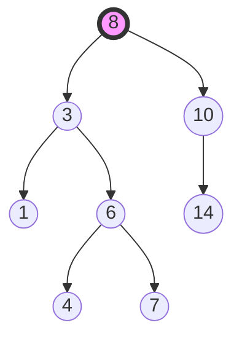
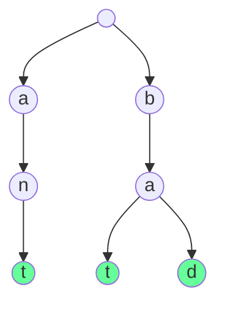

# Trees & Tries

## 1. Binary Trees & BSTs

### Conceptual Overview
A **Tree** is a hierarchical data structure. A **Binary Tree** is a tree where each node has at most two children (Left and Right).
A **Binary Search Tree (BST)** adds a rule: `Left < Parent < Right`.

### Visual Representation

### Complexity (BST)
| Operation | Average | Worst (Skewed) |
| :--- | :--- | :--- |
| **Search** | O(log n) | O(n) |
| **Insert** | O(log n) | O(n) |
| **Delete** | O(log n) | O(n) |

---

## 2. Heaps (Priority Queues)

### Conceptual Overview
A **Heap** is a special Tree-based data structure that satisfies the **Heap Property**:
- **Max-Heap**: Parent is always $\ge$ children. (Root is the maximum).
- **Min-Heap**: Parent is always $\le$ children. (Root is the minimum).

### Memory Trick: Array Implementation
Heaps are almost always implemented using an **Array**, not nodes and pointers. For an index $i$:
- `Left Child`: $2i + 1$
- `Right Child`: $2i + 2$
- `Parent`: $(i-1) // 2$

---

## 3. Tries (Prefix Trees)

### Conceptual Overview
A **Trie** is used for efficient string retrieval. Each node represents a character.
**Use Case**: Autocomplete, Spell checkers, IP routing.

### Visual Representation

---

## 4. Advanced Tree Concepts

### Balanced Trees (AVL, Red-Black)
Standard BSTs can become "skewed" (like a linked list), making operations O(n). Balanced trees use **rotations** to maintain O(log n) height.

### Segment Trees & Fenwick Trees
Used for **Range Queries** (e.g., sum of elements from index $i$ to $j$) and **Point Updates** in O(log n) time.

---

## 5. Developer Tips

### Recursion is King
Most tree problems are solved recursively. If you are stuck, think: "What if I solve it for the left child and right child, then combine the results?"

### Traversal Patterns
- **In-order (L-Root-R)**: Gives elements in sorted order for a BST.
- **Pre-order (Root-L-R)**: Used to clone a tree.
- **Post-order (L-R-Root)**: Used to delete a tree or calculate subtree properties (like height/diameter).
- **Level-order (BFS)**: Uses a Queue to visit nodes layer by layer.
