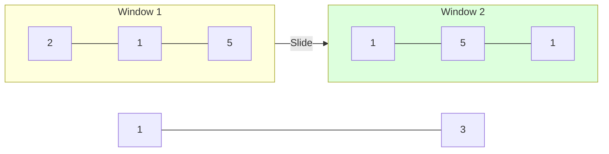
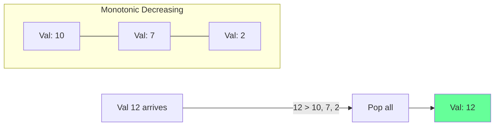

# Algorithmic Pattern: Sliding Window

## 1. Conceptual Overview
The **Sliding Window** pattern is used to perform a required operation on a specific window size of a given array or linked list, such as finding the longest subarray containing all ones.

**Analogy**: A camera lens moving across a long panorama. You only see a "window" of the scene at any time.

---

## 2. Fixed vs. Dynamic Window

### A. Fixed Window
The window size $K$ is constant.
- **Goal**: Find max sum of $K$ elements.
- **Logic**: Add new element, remove oldest element.

### Schematic: Fixed Window (K=3)

### B. Dynamic Window
The window size grows or shrinks based on a condition.
- **Goal**: Longest substring with no repeating characters.
- **Logic**: Expand `right` pointer until condition fails, then shrink `left` pointer.

---

## 3. The Deque Optimization (Sliding Window Maximum)

### Conceptual Overview
Finding the maximum in every sliding window of size $K$ in $O(n)$ time.

### Schematic: Monotonic Deque

---

## 4. Developer Cheat Sheet

| Feature | Fixed Window | Dynamic Window |
| :--- | :--- | :--- |
| **Complexity** | $O(n)$ | $O(n)$ |
| **Pointers** | $i, i+k$ | $left, right$ |
| **State** | Sum, Avg | Map/Set of frequencies |

### Critical Patterns
- **Hash Map + Window**: For substring problems with character counts.
- **Shrink Condition**: Always use a `while` loop to shrink the window until the condition is met.
- **Max vs. Min**: Be careful with what you are tracking (e.g., longest vs. shortest).
