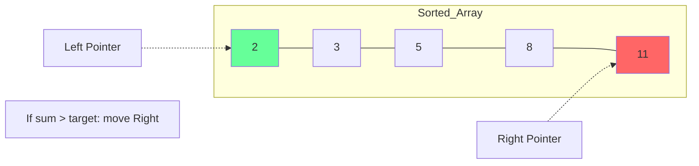

# Algorithmic Pattern: Two Pointers

## 1. Conceptual Overview
The **Two Pointers** pattern uses two indices (pointers) to traverse a data structure (usually an array or linked list) until they meet or a condition is satisfied.

**Analogy**: Two people walking towards each other from opposite ends of a bridge.

---

## 2. Common Variations

### A. Opposite Ends (Convergence)
- **Problem**: 2 Sum on a **Sorted** array.
- **Logic**: If `sum < target`, move `left++`. If `sum > target`, move `right--`.

### Schematic: Two-Way Convergence

### B. Same Direction (Fast & Slow)
- **Problem**: Remove duplicates in-place.
- **Logic**: `slow` tracks the last unique element, `fast` scans for the next unique one.

### C. Multiple Arrays
- **Problem**: Merge sorted arrays.
- **Logic**: `p1` for Array A, `p2` for Array B. Compare and move the smaller one.

---

## 3. The "Two Sum" Evolution

| Constraint | Strategy | Complexity |
| :--- | :--- | :--- |
| **Unsorted Array** | Hash Map | $O(n)$ Time, $O(n)$ Space |
| **Sorted Array** | Two Pointers | $O(n)$ Time, **O(1)** Space |

---

## 4. Developer Cheat Sheet

| Use Case | Pointer Strategy |
| :--- | :--- |
| **Sorted Data** | Opposite Ends (Converging) |
| **In-place modification**| Fast & Slow (Same direction) |
| **Linked List Middle** | Fast & Slow (2x speed) |
| **Merge / Intersect** | Two pointers on separate arrays |

### Critical Patterns
- **Binary Search vs Two Pointers**: If you need to find *one* value, use Binary Search. If you need to find a *pair* or *triplet*, use Two Pointers.
- **Sorting First**: Often, $O(n \log n)$ sort + $O(n)$ Two Pointers is better than $O(n^2)$ brute force.
